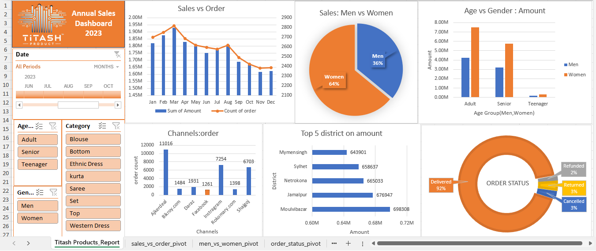

# Sales Data Analysis and Interactive Dashboard for Titash Products - 2023

**Author:** Md Sobahan Mia

## Project Overview
This project involves a comprehensive analysis of the 2023 sales data for Titash Products. The primary goal was to transform raw sales data into actionable insights through data cleaning, transformation, and visualization. The result is an interactive dashboard that provides dynamic data exploration, allowing users to investigate trends across various dimensions such as monthly sales, gender-based purchasing behavior, age groups, and regional sales performance.

## Data Cleaning and Preparation
The dataset initially contained missing values and irrelevant entries in several columns. To prepare the data for analysis, the following steps were applied:
- **Data Cleaning**: Used Excel formulas and filters to remove null values and extraneous data.
- **Standardization**: Leveraged Excel’s "Replace" function to standardize entries, such as converting shorthand gender identifiers ("M" to "Men" and "W" to "Women").
- **Date Transformation**: Applied the `TEXT` function to date fields, isolating months to facilitate month-by-month analysis.

These steps ensured a consistent, usable dataset for further analysis.

## Data Organization and Visualization
After cleaning the data, I used pivot tables to organize key performance metrics, including:
- **Monthly Sales and Order Counts**
- **Gender-Based Purchasing Trends**
- **Regional Sales Distribution**

These metrics were visualized in individual charts and then combined into an interactive dashboard, featuring filters and a timeline slicer for enhanced exploration.

## Key Insights from the Dashboard

### 1. Sales vs. Order Count
   - **Visualization**: Combined line and bar chart.
   - **Insight**: Displays monthly sales revenue alongside order volumes. Notably, sales peaked early in the year and gradually declined toward the end of the year.

### 2. Sales by Gender
   - **Visualization**: Pie chart.
   - **Insight**: Women accounted for 64% of total sales, while men made up 36%, suggesting a potential opportunity to further target female customers in marketing efforts.

### 3. Age Group and Gender Breakdown
   - **Visualization**: Bar chart.
   - **Insight**: Senior women are the highest-spending demographic, followed by adult women, highlighting an opportunity for age-targeted promotions.

### 4. Sales Channels
   - **Visualization**: Bar chart.
   - **Insight**: "Ajkerdeal" emerged as the top-performing sales channel with over 10,000 orders, followed by "Daraz" and "Shopjoi." Focusing on these channels may help maximize order volume and revenue.

### 5. Top 5 Districts by Sales
   - **Visualization**: Horizontal bar chart.
   - **Insight**: Moulvibazar led in sales revenue, with Jamalpur and Netrokona following. This information could guide regional marketing and inventory planning.

### 6. Order Status
   - **Visualization**: Donut chart.
   - **Insight**: 92% of orders were successfully delivered, while 8% included returns, cancellations, and refunds. The high success rate underscores effective order processing, though minor improvements in returns handling could further optimize outcomes.

## Interactive Dashboard Features
The dashboard is designed with user-friendly filters and a timeline slicer, enabling dynamic exploration by time period, category, age group, gender, and sales channel. This interactivity allows users to gain deeper insights into sales patterns and trends, making the dashboard a powerful tool for data-driven decision-making.

## Skills Demonstrated
This project highlights my abilities in:
- **Data Cleaning and Transformation**: Standardizing and preparing raw data using Excel functions.
- **Pivot Tables and Visual Analytics**: Summarizing and visualizing data through pivot tables and charts.
- **Interactive Dashboard Design**: Creating an interactive, user-friendly dashboard that enables flexible data exploration.

By combining visual analytics with interactivity, this dashboard provides an effective tool for understanding sales patterns and supporting strategic business decisions.

---

